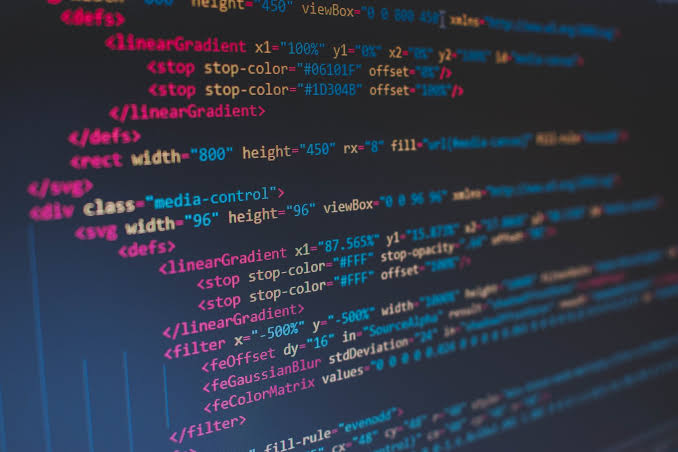

# Лабораторная работа 1

## Информация о студенте

**ФИО:** Решетов В.А.

**Группа:** 6401

**Научный руководитель:** Рубцова Т.П.

**Предполагаемая тема диплома:** Сравнительный анализ и исследование архитектур глубоких нейронных сетей для распознавания лиц

## Любимая цитата

> «Думать — самая трудная работа; вот, вероятно, почему этим так мало занимаются.»

— Генри Форд

